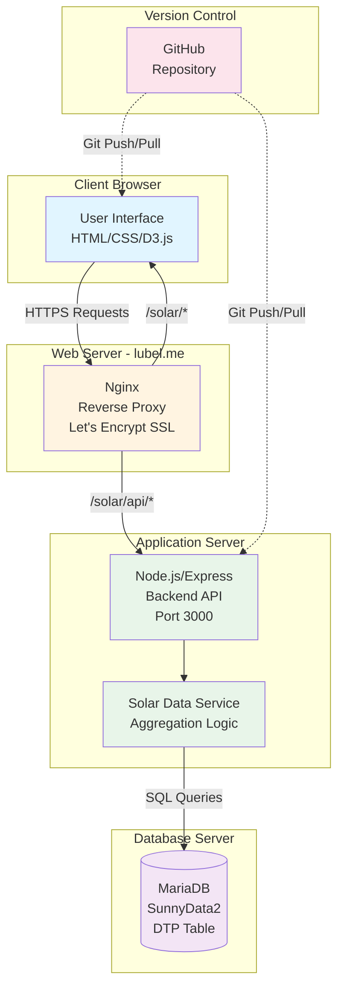
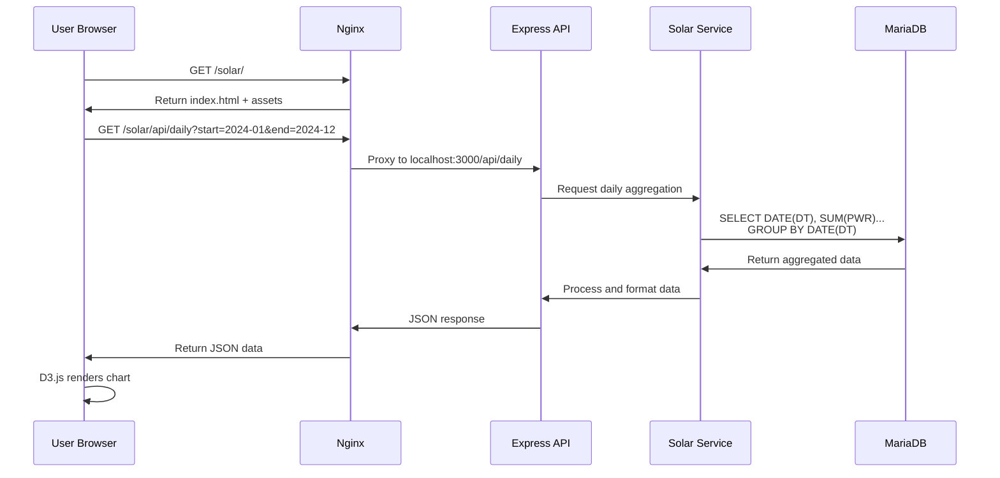
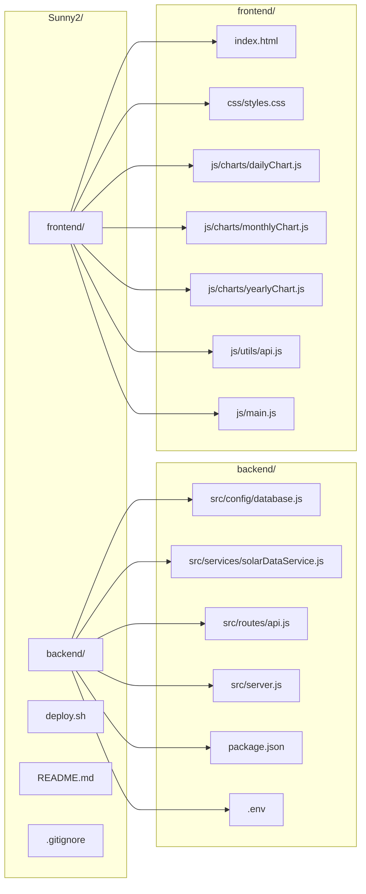
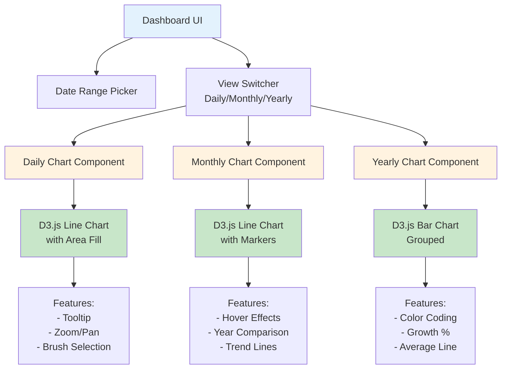
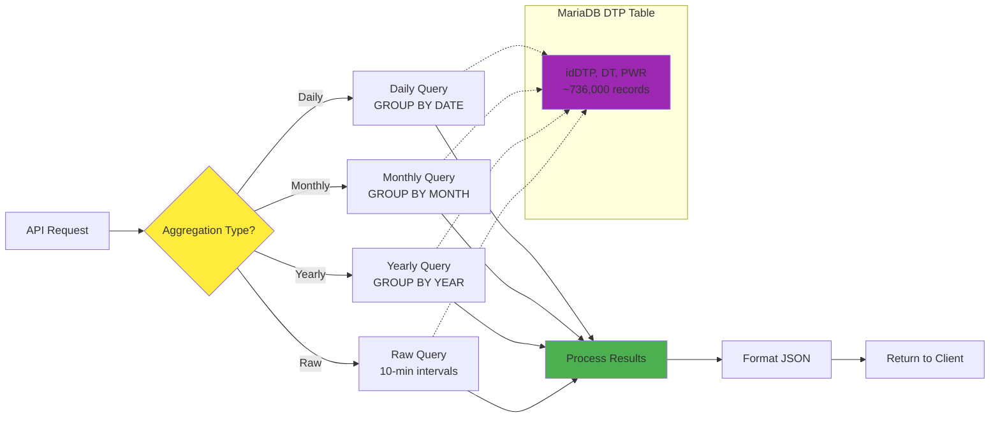
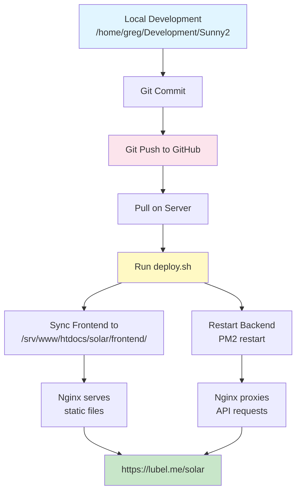
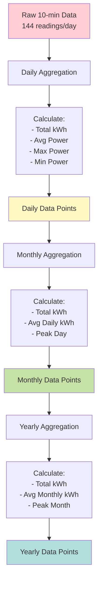
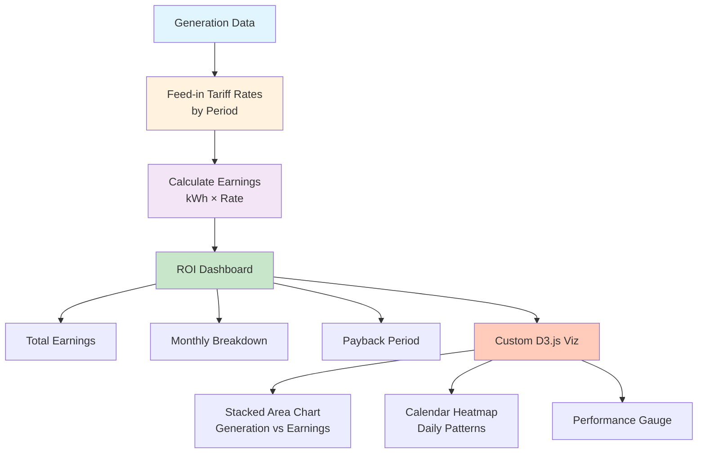
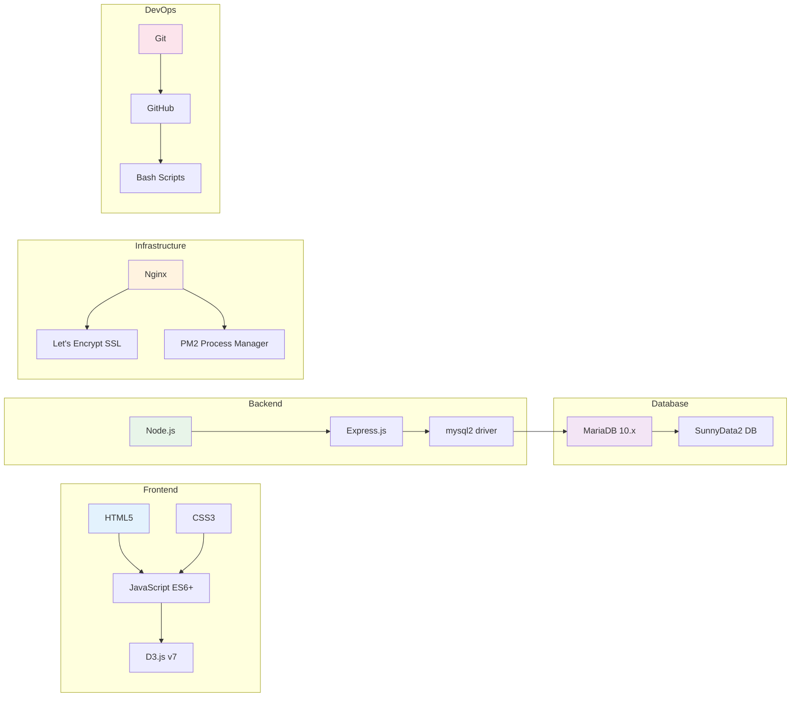

# Solar Dashboard Architecture Diagrams

## System Architecture Overview



## Data Flow Architecture



## Project Structure



## API Endpoint Structure

```mermaid
graph TD
    A[Express Server<br/>localhost:3000] --> B[/api/solar/daily]
    A --> C[/api/solar/monthly]
    A --> D[/api/solar/yearly]
    A --> E[/api/solar/raw]
    
    B --> F[Query Parameters:<br/>start, end]
    C --> G[Query Parameters:<br/>start, end]
    D --> H[Query Parameters:<br/>start, end]
    E --> I[Query Parameters:<br/>start, end, limit, offset]
    
    F --> J[Solar Data Service]
    G --> J
    H --> J
    I --> J
    
    J --> K[(MariaDB<br/>DTP Table)]
    
    style A fill:#4caf50
    style B fill:#2196f3
    style C fill:#2196f3
    style D fill:#2196f3
    style E fill:#2196f3
    style J fill:#ff9800
    style K fill:#9c27b0
```

## D3.js Visualization Components



## Database Query Flow



## Deployment Workflow



## Data Aggregation Logic



## Future Phase 2: ROI Analysis



## Technology Stack



## File System Layout

```
/home/greg/Development/Sunny2/          # Development directory
├── backend/
│   ├── src/
│   │   ├── config/
│   │   │   └── database.js
│   │   ├── services/
│   │   │   └── solarDataService.js
│   │   ├── routes/
│   │   │   └── api.js
│   │   └── server.js
│   ├── package.json
│   ├── package-lock.json
│   └── .env
├── frontend/
│   ├── index.html
│   ├── css/
│   │   └── styles.css
│   ├── js/
│   │   ├── charts/
│   │   │   ├── dailyChart.js
│   │   │   ├── monthlyChart.js
│   │   │   └── yearlyChart.js
│   │   ├── utils/
│   │   │   └── api.js
│   │   └── main.js
│   └── assets/
├── deploy.sh
├── .gitignore
├── .env.example
├── README.md
└── nginx-config-example.conf

/srv/www/htdocs/solar/                  # Production directory
├── frontend/                           # Synced from dev
│   ├── index.html
│   ├── css/
│   ├── js/
│   └── assets/
└── (backend runs as PM2 service)